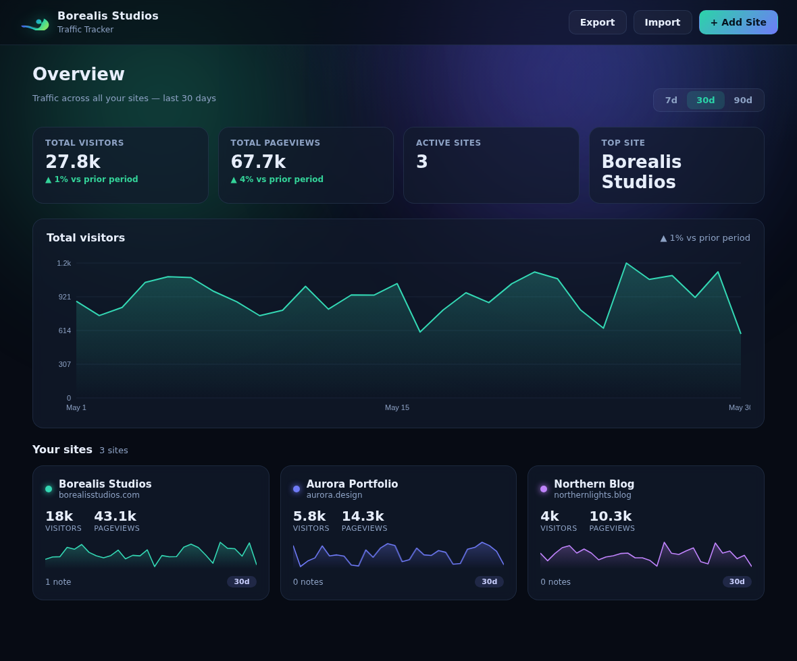

# Borealis Studios — Traffic Tracker

A dashboard to track traffic across all of your websites and keep notes on every
project, with a real backend on **Cloudflare Workers + D1**. Styled to match the
Borealis Studios aurora-wave brand.



## Features

- **Multi-site overview** — total visitors, pageviews, active sites, and your
  top-performing site, with a combined traffic chart.
- **Per-project detail** — visitors vs. pageviews chart, average/day, bounce
  rate, and top pages.
- **Notes** — add, timestamp, and delete notes on any project.
- **Real pageview tracking** — drop a one-line snippet on each site; visits are
  recorded into a D1 database and counted as unique visitors + pageviews.
- **Date ranges** — 7 / 30 / 90 days.
- **Two modes, one codebase**
  - **Live** — when served by the Worker, the dashboard reads/writes the D1
    backend (green "● Live" badge).
  - **Local demo** — open `public/index.html` directly and it runs on seeded
    sample data in `localStorage`, no backend needed.

## Project layout

| Path | Purpose |
|------|---------|
| `public/` | The dashboard (static HTML/CSS/JS) served by the Worker |
| `worker/index.js` | API + `/collect` endpoint, talks to D1 |
| `schema.sql` | D1 tables (`sites`, `events`, `notes`) |
| `wrangler.toml` | Cloudflare config |

## Deploy to Cloudflare (real tracking)

You need a free Cloudflare account. From this folder:

```bash
# 1. Install the CLI and log in
npm install -g wrangler
wrangler login

# 2. Create the D1 database, then paste the printed database_id into wrangler.toml
wrangler d1 create borealis_traffic

# 3. Create the tables
wrangler d1 execute borealis_traffic --remote --file schema.sql

# 4. Ship it
wrangler deploy
```

Wrangler prints your URL, e.g. `https://borealis-studios-tracker.<you>.workers.dev`.
Open it — the badge reads **● Live** and any sites/notes you add are stored in D1.

### Add a site and start tracking

1. Open your deployed dashboard and click **+ Add Site**.
2. Open the site, click **Tracking snippet**, and copy it.
3. Paste it before `</body>` on the website you want to track:

```html
<script>
(function(){
  var SITE_ID = "your-site-id";
  var img = new Image();
  img.src = "https://your-worker.workers.dev/collect?site=" + SITE_ID +
            "&path=" + encodeURIComponent(location.pathname) +
            "&t=" + Date.now();
})();
</script>
```

That's it — pageviews flow into your dashboard. Each `/collect` hit is one
pageview; unique visitors are counted per day from a privacy-friendly hash of
IP + user-agent (no cookies, no personal data stored).

## Develop locally

```bash
npm install -g wrangler
wrangler dev          # runs the Worker + a local SQLite D1 at http://localhost:8787
```

Or, for a quick look without any backend, just open `public/index.html` in a
browser (local demo mode with sample data).

## Data & privacy

Live data lives in your Cloudflare D1 database. The tracker stores only a daily
one-way hash per visitor — no IP addresses, cookies, or personal information.
In local demo mode, data stays in your browser's `localStorage`.
